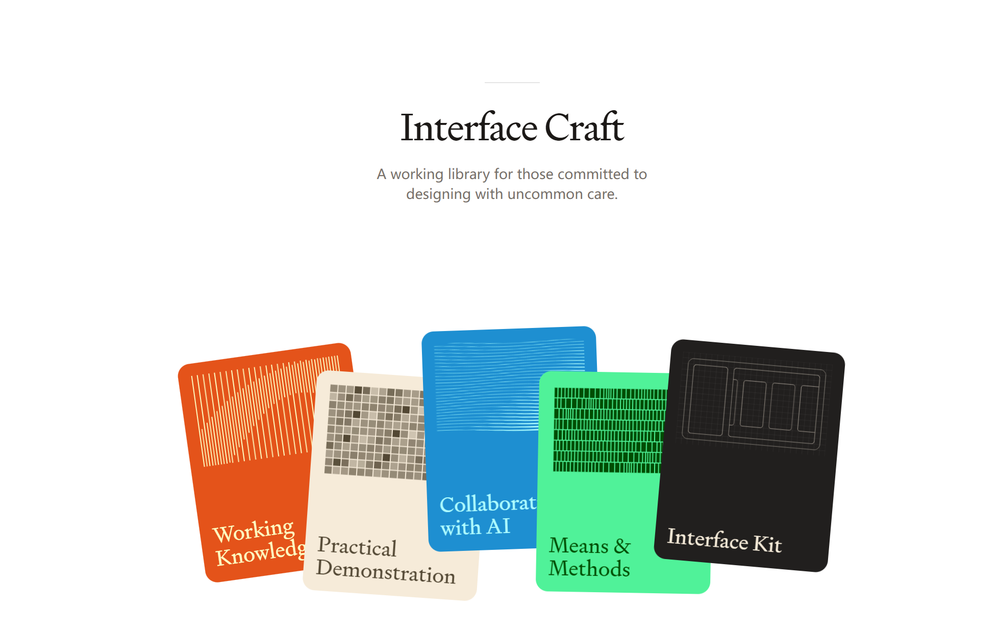

# UI/UX Pro Max — 完整风格参考系统

> 设计师的一站式风格灵感库。探索 20 种 UI 风格、22 种专业配色、18 种艺术效果，实时预览并一键生成 AI 提示词与设计令牌。

[Live Demo](https://rhodriroy.github.io/aesthetic-lab/) · [中文介绍](#项目简介)



## 项目简介

**UI/UX Pro Max** 是一个面向设计师与开发者的完整 UI 设计风格参考系统。它将风格库、配色方案、字体配对、艺术效果、实时预览和 AI 提示词生成整合在一个单页应用中，打通了「灵感探索 → 风格定义 → AI 辅助创作 → 开发落地」的完整链路。

## 核心功能

### 风格库（20 种）
涵盖从经典到前卫的主流 UI 风格，每种风格均包含：
- 风格定义、氛围描述、关键词标签
- 专属 prompt 模板（可直接用于 Midjourney / Stable Diffusion）
- 字体搭配推荐（英文 + 中文）
- 文化溯源 walkthrough（起源、特征、应用场景）
- 关联风格与推荐艺术效果

支持风格：**Neubrutalism** · **Glassmorphism** · **Neomorphism** · **Dark Mode** · **Gradient Mesh** · **Bauhaus** · **Swiss** · **Minimalist** · **Cyberpunk** · **Art Deco** · **Material Design 3** · **iOS** · **Fluent** · **Atomic Design** · **Neo-Brutalism** · **Claymorphism** · **Skeuomorphism** · **Flat 2.0** · **Line Art** · **Japanese Zen**

### 配色方案（22 种）
- **行业配色**：SaaS、Healthcare、Fintech、Social Media、AI/Chatbot、E-commerce、Education 等
- **创意配色**：Candy Pop、Summer Vibes、Neon Night、Street Sport
- **国风传统色**：故宫红墙、敦煌飞天、水墨江南、青花瓷韵、金秋桂香、朱砂印章、竹林清风、牡丹富贵、三星堆青铜、桃李青春、三星堆·现代、千里江山

每种配色包含完整的 14 色设计令牌（primary / secondary / accent / background / foreground / card / muted / border / destructive / ring 等）。

### 字体配对
- **英文字体**：10 种专业配对（Inter、Playfair Display、Poppins、Orbitron、Cormorant 等）
- **中文字体**：10 种配对（MiSans、得意黑、霞鹜文楷、悠哉、小赖体、思源宋体等开源字体）
- 每种配对均标注适用场景与氛围说明

### 艺术效果（18 种）
跨风格的艺术方向叠加层，为界面注入独特视觉气质：

| 类别 | 效果 |
|------|------|
| 印刷艺术 | 波普艺术、RISO 印刷 |
| 绘画艺术 | 野兽派、山水墨韵 |
| 数字艺术 | 新丑风、像素风、故障艺术、酸性设计、Y2K、蒸汽波、赛博朋克 |
| 设计运动 | 包豪斯、粗野主义、孟菲斯、瑞士国际主义 |
| 文化风格 | 三星堆·现代、Art Nouveau、De Stijl、欧普艺术 |

每种效果支持参数化调节（强度、饱和度、纹理、错位等），并提供轻/中/重三档预设。

### 实时预览（9 种模式）
在真实场景中即时查看风格 × 配色 × 字体 × 艺术效果的组合效果：
- 组件展示、登录页、Dashboard、落地页、表单页、数据表格、设置页、空状态、海报

海报模式支持 3 种模板（网格 / 极简宣言 / 粗野主义）和 4 种尺寸（A4 / 方形 / Story / 宽屏），可导出 PNG。

### AI 提示词生成
基于当前选中的风格、配色、字体和艺术效果，一键生成：
- 快速版 / 标准版 / 详细版
- Midjourney / DALL-E / Stable Diffusion / ChatGPT 专用格式
- 支持历史记录与导出为 `.txt`

### 设计令牌导出
一键导出为多种开发与设计工具格式：
- Tailwind CSS
- CSS Variables
- Figma Tokens（含 DTCG 格式）
- Figma Plugin 导入脚本
- SwiftUI / Jetpack Compose
- 完整 JSON

### 其他特性
- **收藏系统**：保存喜欢的风格组合，支持标签与备注
- **主题合集**：一键应用预设场景组合（国风特辑、赛博朋克之夜、极简工作流、Z 世代潮牌、深夜编辑器、孟菲斯派对）
- **撤销/重做**：20 步历史栈，支持快捷键 Ctrl+Z / Ctrl+Shift+Z
- **URL 状态分享**：当前配置编码在 URL hash 中，复制链接即可共享
- **智能联动推荐**：选择特定配色时自动推荐关联艺术效果
- **深色/浅色/自动主题**：支持系统主题跟随
- **移动端适配**：底部导航栏 + 触控优化
- **海报导出**：基于 html2canvas 生成 PNG

## 快速开始

无需构建工具，直接打开 `index.html` 即可运行。

```bash
# 克隆仓库
git clone https://github.com/RhodriRoy/aesthetic-lab.git

# 进入目录
cd aesthetic-lab

# 本地打开（任意静态服务器）
# Python 3
python -m http.server 8080
# Node.js
npx serve .
# 或直接双击 index.html
```

然后在浏览器访问 `http://localhost:8080`。

## 技术栈

- **HTML5** + **Tailwind CSS**（CDN）
- **Vanilla JavaScript**（无框架依赖）
- **Google Fonts** + 中文开源字体（MiSans、霞鹜文楷、得意黑、悠哉、小赖体等）
- **html2canvas**（海报导出）

## 项目结构

```
.
├── index.html              # 主页面（单页应用）
├── styles.css              # 自定义样式与风格类
├── app.js                  # 核心逻辑（状态管理、渲染、导出、交互）
├── ui-ux-pro-max-data.js   # 风格库、配色、字体数据
├── art-effects-data.js     # 艺术效果数据
├── collections-data.js     # 主题合集数据
├── 参考页面.png             # 参考设计图
└── README.md               # 项目说明
```

## 快捷键

| 快捷键 | 功能 |
|--------|------|
| `Enter` | 进入工作台（欢迎页） |
| `Ctrl + Z` | 撤销 |
| `Ctrl + Shift + Z` | 重做 |
| `R` | 随机组合 |
| `F` | 收藏当前组合 |
| `E` | 打开/关闭艺术效果面板 |

## 浏览器兼容性

- Chrome / Edge / Firefox / Safari 最新版
- 支持移动端浏览器

## 许可证

[MIT](LICENSE)

---

> 作为一个非编程专业出身的学生，我在 AI Agent 的辅助下独立完成了这个项目。如果你发现任何问题或有改进建议，欢迎提交 Issue 或 PR！
